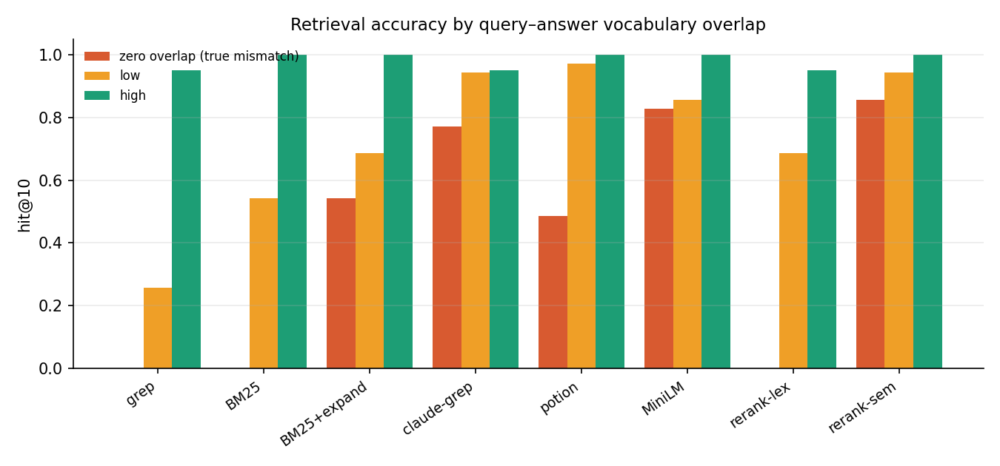
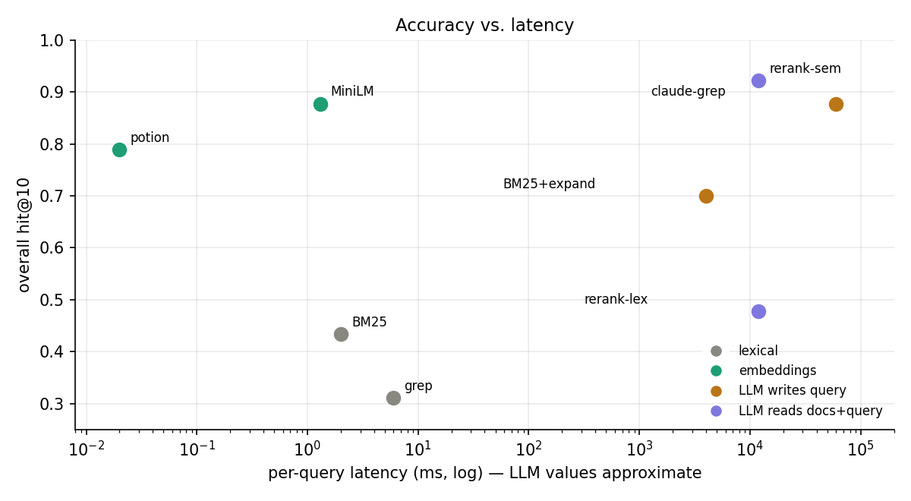

# Vocabulary mismatch: grep vs. semantic vs. LLM search

A reproducible benchmark of how badly **vocabulary mismatch** (query and answer use different
words) hurts lexical search on natural-language text, how well **semantic embedding search** closes
the gap, and where **LLMs** sit — depending on *how* the LLM is used: writing the search query
blind, vs. seeing the documents and the query together.





## TL;DR

1. **Vocabulary mismatch is a hard zero for lexical search, not a soft penalty.** On genuine
   zero-overlap queries (no query word-stem appears in the answer), `grep` and `BM25` score
   **0.00 hit@10** — they cannot match words that aren't there. Dense embeddings (MiniLM) recover
   **83%** of those same queries.
2. **"LLM sees docs + query" beats "LLM writes the query" — and the latter scales with agency.**
   Blind one-shot query expansion recovers 54% of the zero bucket; *agentic* grep (iterate, read
   hits, guess synonyms) reaches 77%; reading semantically-retrieved candidates reaches 86%.
3. **The gap-closing power is in the retrieval, not the reading.** An LLM reranking *lexical*
   candidates scores **0.00** on zero-overlap (the gold is never in the pool — first-stage recall@20
   is 0/35); reranking *semantic* candidates scores **0.86**. Letting an LLM read documents does
   nothing for vocabulary mismatch if those documents were fetched lexically.
4. **Plain dense embeddings are the value winner.** MiniLM matches agentic-grep on overall hit@10
   (0.88), beats it on zero-overlap (0.83 vs 0.77), at ~1 ms and zero token cost per query vs.
   seconds and thousands of tokens. The only arm that beats it (semantic rerank, 0.92) *uses MiniLM
   as its first stage* and pays ~10,000× the latency for +4 points.

## Method

- **Corpus**: 8,941 human-written passages streamed from **MS MARCO v2.1** (`microsoft/ms_marco`),
  pooled across queries into one shared retrieval corpus.
- **Queries**: 904 real typed Bing search queries; each query's `is_selected` passage is its gold answer.
- **Vocabulary-mismatch buckets**: queries are bucketed by **Porter-stemmed term overlap** between
  the query and its gold passage. Stemming is essential — without it, plurals (`psychopath` vs.
  `psychopaths`) masquerade as mismatch and make lexical search look artificially weak.
  - `zero` — no query word-stem appears in the answer (genuine mismatch), 104 queries (~12%)
  - `low`  — <50% of query stems appear, 200 (~22%)
  - `high` — ≥50% appear, 600 (~66%)
- **Metrics**: hit@1, hit@10, MRR@10, nDCG@10, reported overall and per bucket.

### The eight arms

| arm | regime | what it does |
|---|---|---|
| `grep` | lexical | real ripgrep, word-boundary, raw query terms (naive floor) |
| `bm25` | lexical | BM25Okapi over Porter-stemmed tokens (strong lexical baseline) |
| `bm25 + LLM-expand` | LLM writes query (blind) | LLM emits synonyms/paraphrase/acronyms from the query alone; BM25 re-run on the augmented query |
| `claude-grep` | LLM writes query (agentic) | LLM searches the corpus with ripgrep, iterating and guessing synonyms |
| `potion` | embeddings | model2vec `potion-retrieval-32M` static embeddings (ultra-fast) |
| `minilm` | embeddings | `all-MiniLM-L6-v2` dense embeddings |
| `rerank / lexical cands` | LLM reads docs+query | LLM reranks the top-20 **BM25** candidates |
| `rerank / semantic cands` | LLM reads docs+query | LLM reranks the top-20 **MiniLM** candidates |

## Results (90-query subset: 35 zero / 35 low / 20 high, all arms comparable)

| arm | regime | hit@1 | hit@10 | MRR@10 | **zero** | low | high |
|---|---|--:|--:|--:|--:|--:|--:|
| grep | lexical | .067 | .311 | .143 | **0.00** | .26 | .95 |
| bm25 | lexical | .078 | .433 | .166 | **0.00** | .54 | 1.00 |
| bm25 + LLM-expand | LLM writes query (blind) | .122 | .700 | .294 | **.54** | .69 | 1.00 |
| claude-grep agentic | LLM writes query (agentic) | .378 | .878 | .540 | **.77** | .94 | .95 |
| potion (static) | embeddings | .122 | .789 | .302 | **.49** | .97 | 1.00 |
| minilm (dense) | embeddings | .300 | .878 | .480 | **.83** | .86 | 1.00 |
| rerank / lexical cands | LLM reads docs+query | .256 | .478 | .323 | **0.00** | .69 | .95 |
| rerank / semantic cands | LLM reads docs+query | .333 | .922 | .502 | **.86** | .94 | 1.00 |

(zero/low/high columns are hit@10. Full-corpus deterministic results on all 904 queries are in
[`REPORT.md`](REPORT.md), regenerated by `report.py`.)

### First-stage recall@20 — what reranking can even see

| first stage | zero | low | high | all |
|---|--:|--:|--:|--:|
| BM25 (lexical)    | **0.00** | 0.69 | 1.00 | 0.49 |
| MiniLM (semantic) | **0.86** | 0.94 | 1.00 | 0.92 |

## Reproduce

```bash
python -m venv .venv && source .venv/bin/activate
pip install -r requirements.txt
# also needs a ripgrep binary on PATH (`rg`)

# Deterministic arms only (no API key) — reproduces grep/BM25/potion/MiniLM + figures:
make deterministic-only

# Full pipeline including the LLM arms (needs ANTHROPIC_API_KEY):
export ANTHROPIC_API_KEY=sk-...
make all
```

The LLM arms can be run two ways:
- **`run_llm_arms.py`** — a standalone Anthropic-SDK port (used by `make all`). Requires
  `ANTHROPIC_API_KEY`; model defaults to `claude-opus-4-8` (override with `MODEL=...`).
- **`workflow/llm_arms_workflow.js`** — the original [Claude Code](https://www.anthropic.com/claude-code)
  multi-agent workflow that produced the committed numbers (123 agents, ~3.4M tokens).

LLMs are nondeterministic, so the LLM-arm numbers will vary slightly run to run.

## Repo layout

```
build_corpus.py        stream MS MARCO -> shared corpus + bucketed queries
common.py              tokenization, stemming, overlap metric
arms_deterministic.py  grep / BM25 / MiniLM / potion + latency
prep_candidates.py     top-20 candidate pools + first-stage recall
prep_llm_inputs.py     per-agent input files for the LLM arms
run_llm_arms.py        standalone LLM arms (Anthropic SDK)
workflow/              the original Claude Code workflow
analyze.py             merge all arms, per-bucket metrics
metrics.py             hit@k, MRR, nDCG
make_figures.py        figures/*.png
report.py              REPORT.md
results/*.json         committed aggregate metrics (raw rankings are regenerated)
```

## Caveats

- MS MARCO labels are sparse (one gold passage per query), so absolute hit@1 understates every
  method equally; the *relative* and *per-bucket* comparisons are the trustworthy part.
- Pooling passages across queries can introduce false negatives (a passage relevant to query B but
  only labeled for query A). This is standard for pooled IR eval and affects all arms equally.
- LLM-arm latencies in the scatter plot are order-of-magnitude estimates; deterministic latencies are
  measured.

## Data & attribution

This project uses the [MS MARCO](https://microsoft.github.io/msmarco/) dataset (v2.1), intended for
non-commercial research. The corpus is **not redistributed** here — `build_corpus.py` streams and
regenerates it from Hugging Face. If you use MS MARCO, cite the original authors.

## License

[MIT](LICENSE)
